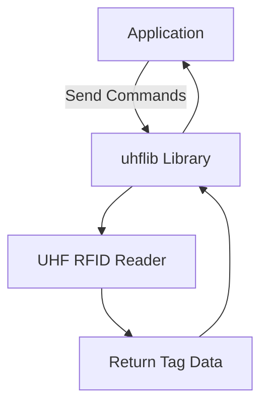

# uhflib

## Overview

**uhflib** is an open-source, multi-language library designed to facilitate seamless communication with UHF RFID readers. Available in Java, Go, JS, C#, Python, and PHP, uhflib provides a simple and consistent API for developers to integrate UHF RFID functionality into their applications. The library is designed to be customizable and extendable, making it suitable for a variety of RFID use cases.

## Setup Guide

### Prerequisites

- **Java 11 or higher** (for Java users)
- **Go 1.16 or higher** (for Go users)
- **Node.js 14 or higher** (for JavaScript users)
- **.NET 5 or higher** (for C# users)
- **Python 3.6 or higher** (for Python users)
- **PHP 7.4 or higher** (for PHP users)
- **UHF RFID reader** with a serial communication interface

### Installation

#### Java

```xml
<!-- Add this dependency to your pom.xml -->
<dependency>
    <groupId>com.github.lucasliao</groupId>
    <artifactId>uhflib</artifactId>
    <version>1.0.0</version>
</dependency>
```

#### Go

```bash
go get github.com/lucasliao/uhflib
```

#### JavaScript (Node.js)

```bash
npm install uhflib
```

#### C#

```bash
dotnet add package Uhflib --version 1.0.0
```

#### Python

```bash
pip install uhflib
```

#### PHP

```bash
composer require lucasliao/uhflib
```

## High-Level Architecture



## Architecture

### Core Components

1. **Serial Communication Module:**
   - Handles the serial connection between the application and the UHF RFID reader.
   - Manages command sending and response reading, ensuring reliable communication.

2. **Command Parser:**
   - Parses the commands sent to the UHF reader and interprets the responses.
   - Provides error handling and retries for robust operation.

3. **UHF Control Interface:**
   - Offers high-level methods to control UHF reader functionalities, such as setting power levels, adjusting ping rates, and reading tags.

4. **Multi-Language Support:**
   - Provides language-specific bindings for easy integration across Java, Go, JS, C#, Python, and PHP.

### Standards and Best Practices

- **Cross-Platform Compatibility:** Ensures that the library can be used across different operating systems and development environments.
- **Code Quality:** Adheres to industry standards for readability, maintainability, and extensibility.
- **Error Handling:** Implements robust error handling and retry mechanisms to deal with communication failures.
- **Security:** Ensures secure communication with the UHF reader by validating all input data and controlling access to the reader.

## Usage Examples

### Example 1: Single Scan (First Object)

```python
from uhflib import UHFReader

reader = UHFReader('COM4', 115200)
reader.connect()
tag_data = reader.read_tag()
print(f"First Tag Data: {tag_data}")
reader.disconnect()
```

**Explanation:** This example demonstrates how to perform a single scan to retrieve the first detected RFID tag's data.

### Example 2: Continuous Scanning (Multiple Objects, Remove Duplicates)

```python
import time
from uhflib import UHFReader

reader = UHFReader('COM4', 115200)
reader.connect()

seen_tags = set()

try:
    while True:
        tag_data = reader.read_tag()
        if tag_data and tag_data not in seen_tags:
            print(f"New Tag Detected: {tag_data}")
            seen_tags.add(tag_data)
        time.sleep(0.1)  # Adjust the scan rate as needed
except KeyboardInterrupt:
    print("Stopping continuous scan.")
finally:
    reader.disconnect()
```

**Explanation:** This example continuously scans for RFID tags, removing duplicates and showing a list of unique tags in real-time.

### Example 3: Controlling UHF Intensity (Adjusting dBm)

```python
from uhflib import UHFReader

reader = UHFReader('COM4', 115200)
reader.connect()

# Set the UHF reader power level to 30 dBm
reader.set_power_level(30)

# Perform a scan to see how the power adjustment affects detection
tag_data = reader.read_tag()
print(f"Tag Data with 30 dBm: {tag_data}")

reader.disconnect()
```

**Explanation:** This example demonstrates how to control the power output of the UHF reader by adjusting the dBm level, which can help in controlling the read range and intensity.

### Example 4: Controlling Ping Rate (Adjusting Scan Interval)

```python
from uhflib import UHFReader

reader = UHFReader('COM4', 115200)
reader.connect()

# Set the ping rate to 5 seconds
reader.set_ping_rate(5000)  # 5000 milliseconds

# Perform scanning with the new ping rate
while True:
    tag_data = reader.read_tag()
    if tag_data:
        print(f"Tag Data: {tag_data}")
    time.sleep(5)

reader.disconnect()
```

**Explanation:** This example shows how to control the ping rate of the UHF reader, setting it to scan every 5 seconds.

## Industry Standards

**uhflib** adheres to the following industry-standard practices:

- **Security:** Ensures secure communication by validating all data exchanged with the UHF RFID reader.
- **Performance:** Optimized for low latency and efficient resource usage.
- **Reliability:** Includes robust error handling, retries, and logging mechanisms.
- **Flexibility:** Offers customizable parameters for different use cases, such as adjusting power levels and scan intervals.
- **Scalability:** Designed to support large-scale deployments and continuous operation.

## Process Flow

### 1. **Connecting to the UHF Reader**
   - **Input:** Serial port and baud rate.
   - **Process:** Establishes a serial connection with the UHF reader.
   - **Output:** Connection confirmation or error message.

### 2. **Sending Commands**
   - **Input:** Command bytes to be sent to the UHF reader.
   - **Process:** Sends the command and waits for a response.
   - **Output:** Reader response or retry upon failure.

### 3. **Reading Tags**
   - **Input:** None (uses the open connection).
   - **Process:** Reads tag data detected by the UHF reader.
   - **Output:** Raw tag data or parsed tag information.

### 4. **Adjusting Reader Settings**
   - **Input:** Desired settings (e.g., power level, ping rate).
   - **Process:** Sends configuration commands to adjust reader behavior.
   - **Output:** Confirmation or error message.

## Technology Stack

- **Python/C#/.NET/Java/Go/JS/PHP:** Multi-language support for flexible integration.
- **Serial Communication:** Reliable, low-level communication with UHF RFID readers.
- **Cross-Platform:** Compatible with major operating systems (Windows, macOS, Linux).

### Quality Attributes

1. **Security:** Ensures secure command transmission and data handling.
2. **Performance:** Optimized for fast, reliable tag detection.
3. **Reliability:** Built-in error handling and retries ensure robust operation.
4. **Flexibility:** Easily customizable for various RFID reader configurations.
5. **Scalability:** Designed to handle multiple readers and large datasets efficiently.

## Contribution

We welcome contributions from the community! Please follow these guidelines:

1. **Fork the repository.**
2. **Create a feature branch:** `git checkout -b feature/YourFeature`
3. **Commit your changes:** `git commit -m 'Add YourFeature'`
4. **Push to the branch:** `git push origin feature/YourFeature`
5. **Open a Pull Request.**

Please ensure all new code follows coding standards and includes appropriate tests.

## License

This project is licensed under the MIT License - see the [LICENSE](LICENSE) file for details.

## Support

If you encounter any issues or have questions, feel free to open an issue on GitHub.
